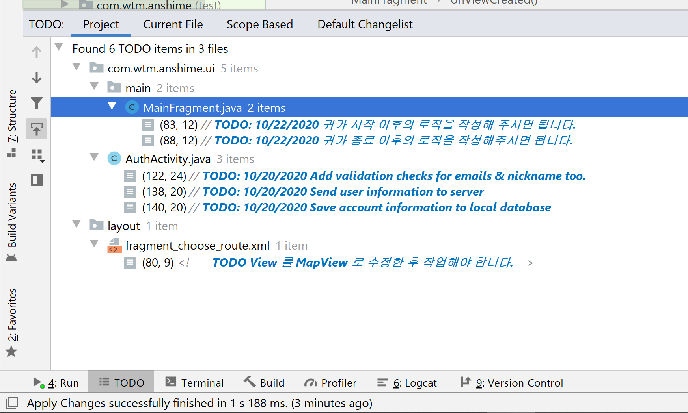

# 안심이 앱

### git flow

#### common rules 
* 작업을 시작하기 전 issue 를 생성. issue 제목에 작업 내용을묘사하고 Label 섹션에서 관련되는 라벨을 추가하기 
* 작업을 마친 후 commit 메시지에 "close #[이슈번호]" 와 같이 해서 작업 브랜치 자동으로 삭제하기 

#### feature
* 모든 기능들은 'feat-[기능이름]'과 같이 브랜치를 만들어서 작업하기 
* commit 메시지에는 feat : [작업 내용] 과 같이 커밋하기 

#### etc. 
* 사소한 버그 픽스는 bug 라벨 붙여서 이슈 생성하기. 커밋 메시지에는 bugfix : [작업 내용] 과 같이 명시하기 
* 버그 픽스는 아니지만 사소한 업데이트의 경우 (예를 들어 변수명을 바꾼다거나) chore 라벨 붙여서 이슈 생성하기. 커밋 메시지에는 chore : [작업내용] 과 같이 명시하기. 
* 작업 1주차 완료 후 dev 브랜치의 기능들을 점검한 후 main 브랜치에 푸시하기. 

---

* MainFragment 의 귀가 시작, 귀가 종료 버튼에 대한 로직을 작성해주시면 됩니다. 
* 기타 추가 작업이 필요한 내용들 또한 TODO에서 확인하실 수 있습니다. 